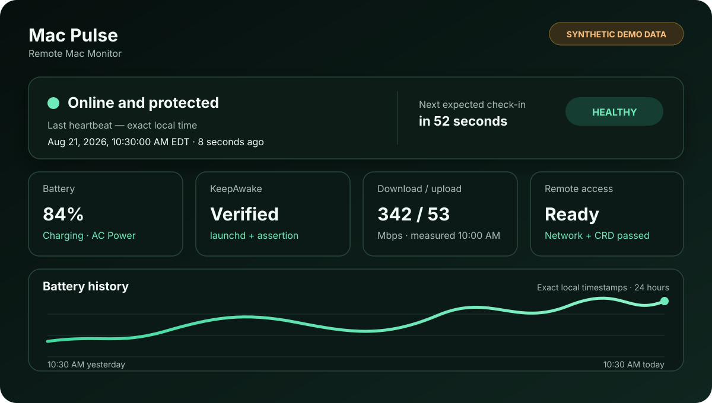

# Remote Mac KeepAwake

[](https://github.com/xudaniel/remote-mac-keepawake/actions/workflows/ci.yml)
[](https://github.com/xudaniel/remote-mac-keepawake/releases/latest)
[](LICENSE)
[](#支持系统与-ci)

[English](README.md) | [简体中文](README.zh-CN.md)  
[英文 PRD](docs/PRD.en.md) | [中文 PRD](docs/PRD.zh-CN.md)

当前版本：v1.4.0



预览图只使用合成数据。架构与信任边界见
[架构说明](docs/ARCHITECTURE.zh-CN.md)。

Remote Mac KeepAwake 使用 macOS 自带的 `caffeinate -i`，并交给
`launchd` 持续管理。它可以防止电脑因为闲置而进入系统睡眠，在进程退出后
自动重启，并为远程管理提供明确、可机器读取的健康检查。

本项目坚持本地优先：

- 不需要第三方运行环境或后台服务器；
- 不需要注册账号或使用云服务；
- 默认不发送任何遥测数据；
- 只有在 launchd 状态、PID 和防睡眠 assertion 全部验证成功后才显示成功。

## 能力边界

本工具只能在 `caffeinate` 服务健康运行时防止**闲置系统睡眠**，显示器仍然
可以正常自动熄灭。

没有任何软件能够保证远程 Mac 永远在线。本项目无法解决：

- MacBook 合盖或电池耗尽；
- 充电器、插座、路由器、Wi-Fi、运营商或硬件故障；
- 强制关机、kernel panic 或操作系统故障；
- 完整重启后的 FileVault 启动前解锁界面。

如果 Mac 已经睡眠或关机，GitHub 仓库本身无法唤醒它。远程使用的 MacBook 应
保持开盖、连接稳定电源和网络，按需要启用“通过网络唤醒”，并保留第二条远程
访问路径。

## 快速安装

普通用户模式不需要 `sudo`：

```bash
git clone https://github.com/xudaniel/remote-mac-keepawake.git
cd remote-mac-keepawake
./bin/remote-mac-keepawake install --user
```

安装后的稳定命令路径：

```text
$HOME/.local/bin/remote-mac-keepawake
```

如果 shell 找不到命令，可加入 PATH：

```bash
export PATH="$HOME/.local/bin:$PATH"
remote-mac-keepawake status --user
```

显示安装成功代表以下三项都已通过：

1. plist 已安装且语法有效；
2. launchd 报告服务正在运行并有受管 PID；
3. `pmset -g assertions` 确认该 PID 正在阻止闲置系统睡眠。

## 专用远程 Mac：系统模式

用户模式需要该用户登录后才启动。系统模式在开机过程中启动，不依赖图形界面
登录，并把 CLI 安装到：

```text
/usr/local/bin/remote-mac-keepawake
```

把现有用户模式安全迁移到系统模式：

```bash
sudo "$HOME/.local/bin/remote-mac-keepawake" migrate --system --yes
sudo /usr/local/bin/remote-mac-keepawake recovery-check --system
```

迁移过程中，原用户服务会一直保留，直到系统 LaunchDaemon 的属主、文件权限、
plist、launchd domain、PID 和 assertion 全部验证成功。如果系统服务激活失败，
用户模式仍然可用。

只有在能够现场恢复电脑时才执行迁移或重启。如果 FileVault 已开启，远程软件
无法通过重启后的启动前解锁界面。

## 常用命令

安装后可以在任何目录运行：

```bash
remote-mac-keepawake status
remote-mac-keepawake status --json
remote-mac-keepawake status --watch --interval 30
remote-mac-keepawake health --json
remote-mac-keepawake restart
remote-mac-keepawake self-test
remote-mac-keepawake doctor
remote-mac-keepawake logs
```

暂时允许正常闲置睡眠：

```bash
remote-mac-keepawake stop
```

重新启用并验证：

```bash
remote-mac-keepawake start
```

## 健康检查

`health` 提供稳定的 JSON 字段和适合脚本使用的退出码：

| 退出码 | 状态 | 含义 |
| --- | --- | --- |
| `0` | healthy | 服务、PID 和 assertion 均正常。 |
| `1` | unavailable | 服务、PID 或 assertion 缺失。 |
| `2` | degraded | 显式检查的依赖存在风险。 |

```bash
remote-mac-keepawake health --json
remote-mac-keepawake health --json --network --chrome
```

默认检查完全在本机完成，包括：

- launchd 模式和服务状态；
- 受管 PID 和防睡眠 assertion；
- 电源来源、电量和充电状态；
- 电池状况、循环次数、设计/满充容量、估算健康度和 macOS 温控压力状态；
- MacBook 合盖状态。

可选检查：

- `--network`：确认默认路由，并向 Apple 网络连通性页面发送 HTTPS HEAD
  请求；
- `--chrome`：在本机检查 Chrome Remote Desktop Host 进程。

默认情况下这两项都不会运行。

## 持续监测和告警

Watch 模式只保留最新 200 条 JSON 记录：

```bash
remote-mac-keepawake health --watch --interval 60
```

可选的状态变化告警：

```bash
remote-mac-keepawake health --watch --notify --interval 60
remote-mac-keepawake health --watch \
  --webhook https://example.com/remote-mac-health
```

通知和 webhook 都必须显式启用。Webhook 只接受 HTTPS，发送内容仅包括服务名、
健康状态和安装模式，不包含主机名、用户名、PID、电量或任何密钥。

## 可选远程面板：Mac Pulse

`dashboard/` 提供适合手机查看的私密页面，实时显示心跳新鲜度、电量、充电与
电源状态、合盖状态、launchd 服务、防睡眠 assertion、版本、远程连接诊断、
提醒和包含本地准确时间的完整历史。可选的远程 Mac 测速还会显示下载、上传、
空闲延迟、响应能力以及测速本身的准确时间。

如果面板只运行在被监控的 Mac 上，电脑睡眠后页面也会一起消失。Mac Pulse 会在
用户显式启用后，把最小化心跳保存到电脑之外；连续 90 秒没有心跳时，面板会把
电脑标记为离线。这可能表示睡眠、断电、断网、关机或其他故障，但面板不会假装
能够判断具体原因。

部署面板并取得私密上传密钥后：

```bash
read -rs MAC_PULSE_INGEST_TOKEN
read -rs MAC_PULSE_SITES_TOKEN
printf '%s\n%s\n' "$MAC_PULSE_INGEST_TOKEN" "$MAC_PULSE_SITES_TOKEN" | \
  ./bin/remote-mac-heartbeat install \
  --url https://your-private-dashboard.example/api/heartbeat \
  --token-stdin --sites-token-stdin --key-id current --user \
  --network-diagnostics --internet-speed
unset MAC_PULSE_INGEST_TOKEN MAC_PULSE_SITES_TOKEN
./bin/remote-mac-heartbeat status
```

上报组件每 60 秒运行一次。每次上传都会使用 HMAC-SHA-256 对 key ID、传输时间、
样本 ID 和正文摘要签名；服务端强制五分钟防重放窗口，并在不保存来源 IP 的前提下
限制认证失败频率。上报不发送电脑名称、用户名、IP 地址、设备序列号、位置
或密钥。生产站点使用仅限所有者的身份会话查看数据；上传密钥与私密站点自动
访问令牌继续保持分离。

先在服务端暂存下一把密钥，然后无需重启 reporter 即可轮换：

```bash
read -rs MAC_PULSE_INGEST_TOKEN_NEXT
printf '%s\n' "$MAC_PULSE_INGEST_TOKEN_NEXT" | \
  ./bin/remote-mac-heartbeat rotate-key --key-id next --token-stdin
unset MAC_PULSE_INGEST_TOKEN_NEXT
```

服务端先把 key ID `next` 配置为 `INGEST_TOKEN_NEXT`，Mac 轮换成功后再提升为
主密钥。`INGEST_TOKEN_PREVIOUS` 提供有限回滚槽。生产环境默认拒绝旧式纯 Bearer
上传；迁移期只有显式设置 `ALLOW_LEGACY_INGEST_BEARER=1` 才会接受。

每次上传前，上报组件都会先把样本原子写入权限为 `0700` 的私密本地 outbox。
短暂故障会触发有限次数重试；仍未成功的样本会留在磁盘，网络恢复后按电脑实际
观测时间自动补传。每个样本都有随机幂等 ID，所以结果不明确的重试不会生成重复
历史。`status` 会显示 `pending_samples` 和 `last_success_at`。卸载时会删除密钥，
但保留未发送样本以便重新安装后续传；因此长时间断网会持续占用本地磁盘，直到
补传完成。

`--internet-speed` 会在远程 Mac 上调用 Apple 内置的 `networkQuality`，并自动
开启隐私保护网络诊断。诊断只记录布尔结果、网关延迟/抖动/丢包、规范化故障类别
和准确测量时间，绝不记录网关、DNS、SSID、公网 IP 或 endpoint 标识。只需要
诊断而不测速时使用 `--network-diagnostics`，默认诊断间隔为 300 秒。使用
`--network-probe-url HTTPS_URL` 可改成经过审核的中立 HTTPS 探测端点。
探测进程使用较低 CPU 优先级和严格超时。60 秒心跳会复用缓存结果；默认每
21,600 秒（6 小时）
才重新测速，因为每次测速都会传输数据，也可能短暂占用远程控制带宽。可以使用
`--speed-test-interval SECONDS` 设置 1,800 至 86,400 秒的间隔。两个测速参数都
不提供时，测速完全关闭。

已接收样本不会自动清理。所有者可以通过有范围限制、采用 cursor 分页的接口查看
1 小时至全部历史或自定时间范围，检查本地准确时间与状态变化，导出 CSV，查看
估算存储量和在线率，并通过显式确认流程删除历史。留存仍受托管商容量和项目
生命周期限制。测速结果及其准确时间使用同一套留存、导出和删除流程。
补传样本保留电脑实际观测时间，而不是稍后被网络接收的时间。

可选远程提醒会对离线、电量、电池健康、温控、电源、KeepAwake、网络和 Chrome
Remote Desktop 状态变化去重，并记录恢复事件。Cloudflare Worker 每分钟在 D1
租约保护下检查离线状态，对临时发送失败执行有限退避重试，并可切换到备用
Webhook；可选外部 canary 还能验证 scheduler 本身是否存活。服务端 webhook 目标
绝不会进入心跳数据。
电池健康提醒可分别设置绝对健康度和快速下降阈值；非 critical 温控压力必须连续
两个样本异常才会提醒。

## 重启和登出恢复检查

在有人能够恢复电脑的前提下，重启前运行：

```bash
sudo remote-mac-keepawake recovery-check --system
```

预期结果：

```text
Reboot recovery readiness: ready
Launch domain:            system
RunAtLoad / KeepAlive:    true / true
Service / assertion:      running / true
```

恢复流程：

1. 确认 FileVault 是否开启；
2. 如果已开启，安排现场完成启动前解锁；
3. 只有在远程失联后仍可恢复时才重启；
4. 重新连接后再次运行 `recovery-check --system`；
5. 确认 system domain、`running` 状态、数字 PID，以及
   `idle_sleep_prevented: true`。

只测试登出时，可以退出图形界面账号，通过 SSH 等独立路径重新连接，再运行同一
条系统模式检查命令。

## 原子升级

可直接从经过校验的 GitHub Release 升级：

```bash
sudo remote-mac-keepawake upgrade --system --release latest
# 也可以固定到准确、已审核的版本：
sudo remote-mac-keepawake upgrade --system --release 1.4.0
```

CLI 会通过 HTTPS 下载 release 归档和 `SHA256SUMS`，遇到缺失/不匹配的 checksum
或不安全归档路径会立即拒绝；候选文件验证后才进行原子替换和健康检查。降级必须
显式增加 `--allow-downgrade`。如果可选 heartbeat reporter 已安装，经过验证的
release 会把两个 CLI 作为一个操作同时升级或回滚。本项目不会在后台无人值守
自动更新。

命令失败时会恢复原来的可执行文件；请先修复提示的服务或网络问题，确认
`status --json`，再重试固定版本。只有在已审核的恢复版本确实需要降级时才使用
`--allow-downgrade`。

下载或 clone 已审核的新版本，然后让已安装的 CLI 自行验证并替换：

```bash
sudo remote-mac-keepawake upgrade --system \
  --from /path/to/remote-mac-keepawake/bin/remote-mac-keepawake
```

替换之前，新文件必须通过：

- Bash 语法检查；
- 语义版本检查；
- 可执行权限检查；
- 声明版本与实际输出版本一致性检查。

替换或验证失败时会恢复旧 CLI。

## 卸载

```bash
remote-mac-keepawake uninstall --user
sudo remote-mac-keepawake uninstall --system
```

卸载会逐项打印被删除的项目专属 plist 和 CLI 路径。诊断日志会被保留，并显示其
所在目录。

## Release 与校验

每个语义版本 tag 都会发布：

- 优先使用经过审核的双语 release notes，否则自动生成；
- GitHub 源码压缩包；
- 保留可执行权限的项目归档；
- SPDX 软件物料清单；
- `SHA256SUMS` 和 GitHub artifact provenance attestations。

校验 v1.4.0 下载文件：

```bash
shasum -a 256 -c SHA256SUMS
tar -tzf remote-mac-keepawake-v1.4.0.tar.gz
gh attestation verify remote-mac-keepawake-v1.4.0.tar.gz \
  --repo xudaniel/remote-mac-keepawake
```

项目归档包括两个 CLI、Mac Pulse Dashboard 源码与 migrations、本中文 README、
[英文 README](README.md)、[英文 PRD](docs/PRD.en.md) 和
[中文 PRD](docs/PRD.zh-CN.md)。
归档还包括两种语言的架构说明和对应版本的 release notes。

## 支持系统与 CI

持续测试 GitHub 托管的 macOS 14、macOS 15 和 macOS 26 runner。

CI 检查：

- ShellCheck 与 Bash 语法；
- 用户/系统安装和幂等性；
- plist、bootstrap、kickstart、assertion 和升级故障注入；
- 回滚和清理边界；
- JSON 与 plist 有效性；
- 可执行权限；
- 签名 Heartbeat 安装、密钥轮换、补传、网络诊断、测速缓存和清理；
- Dashboard lint、构建、路由行为和增量 D1 migrations；
- 中英文文档与 release 元数据一致性；
- 真实 LaunchAgent 重启以及恢复后的 `pmset` assertion。

## 产品需求文档

产品范围、用户流程、需求、架构、成功标准和路线图分别记录在：

- [产品需求文档 — 简体中文](docs/PRD.zh-CN.md)
- [Product Requirements Document — English](docs/PRD.en.md)

## 开发与测试

```bash
./tests/test.sh
./tests/docs-test.sh
./tests/heartbeat-test.sh
(cd dashboard && npm ci && npm run lint && npm test)
./.github/tests/launchd-integration.sh
```

集成测试只会操作本项目自己的用户 LaunchAgent，并在退出时清理。

## 许可证

[MIT](LICENSE)
