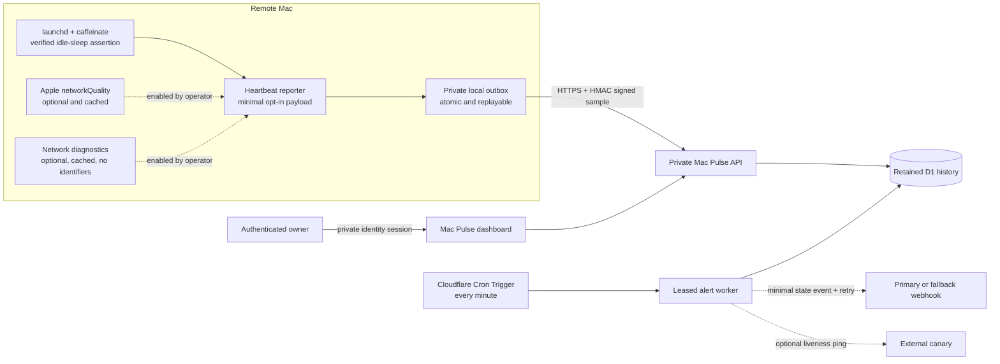

# Architecture

[English](ARCHITECTURE.md) | [简体中文](ARCHITECTURE.zh-CN.md)

Remote Mac KeepAwake is local-first. The optional Mac Pulse path is enabled
only when the operator explicitly installs the heartbeat reporter.

## Trust boundaries

- KeepAwake runs locally and does not require Mac Pulse.
- Viewer identity and heartbeat ingestion use separate authorization paths.
  Each upload has an HMAC-SHA-256 signature, key ID, five-minute replay window,
  and random idempotency ID. Rotation accepts bounded current, next, and
  previous keys without restarting the reporter.
- Heartbeats exclude hostname, username, IP address, serial number, location,
  webhook destination, and credentials.
- Optional network diagnostics persist only booleans, gateway performance,
  normalized fault category, and timestamp—not gateway, DNS, SSID, public IP,
  or endpoint identifiers.
- Each heartbeat is persisted locally before upload. Failed delivery remains in
  the protected outbox and replays with an idempotency ID after recovery.
- Cron runs take a D1 lease before state evaluation. Delivery attempts and
  bounded backoff survive Worker restarts; a fallback webhook and external
  canary are optional and their URLs remain server-side secrets.
- Absence of a heartbeat proves only that the external monitor has not received
  a recent sample; it does not prove a specific root cause.
- FileVault pre-boot unlock, power, network, closed-lid behavior, hardware, and
  operating-system failures remain outside software control.
