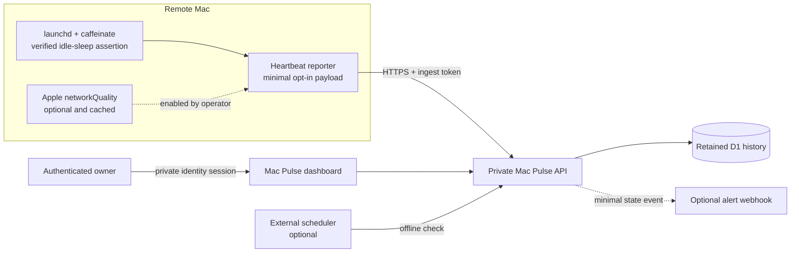

# Architecture

[English](ARCHITECTURE.md) | [简体中文](ARCHITECTURE.zh-CN.md)

Remote Mac KeepAwake is local-first. The optional Mac Pulse path is enabled
only when the operator explicitly installs the heartbeat reporter.

## Trust boundaries

- KeepAwake runs locally and does not require Mac Pulse.
- Viewer identity and heartbeat ingestion use separate authorization paths.
- Heartbeats exclude hostname, username, IP address, serial number, location,
  webhook destination, and credentials.
- Absence of a heartbeat proves only that the external monitor has not received
  a recent sample; it does not prove a specific root cause.
- FileVault pre-boot unlock, power, network, closed-lid behavior, hardware, and
  operating-system failures remain outside software control.
