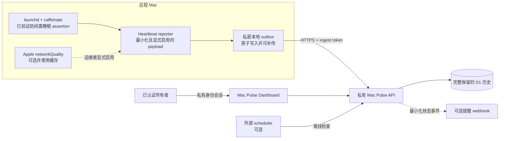

# 架构说明

[English](ARCHITECTURE.md) | [简体中文](ARCHITECTURE.zh-CN.md)

Remote Mac KeepAwake 默认完全在本机运行。只有运维者显式安装 heartbeat reporter
后，才会启用可选的 Mac Pulse 路径。

## 信任边界

- KeepAwake 在本机运行，不依赖 Mac Pulse。
- 查看者身份与 heartbeat 上传使用相互独立的授权路径。
- Heartbeat 不包含电脑名称、用户名、IP 地址、序列号、位置、webhook 目标或密钥。
- 每个 heartbeat 都会在上传前先保存到本地；发送失败时留在受保护 outbox 中，
  恢复后使用幂等 ID 自动补传。
- 没有收到 heartbeat 只能证明外部监控端没有收到近期样本，不能证明具体根因。
- FileVault 启动前解锁、电源、网络、合盖、硬件和操作系统故障均不属于软件能够
  控制的范围。
