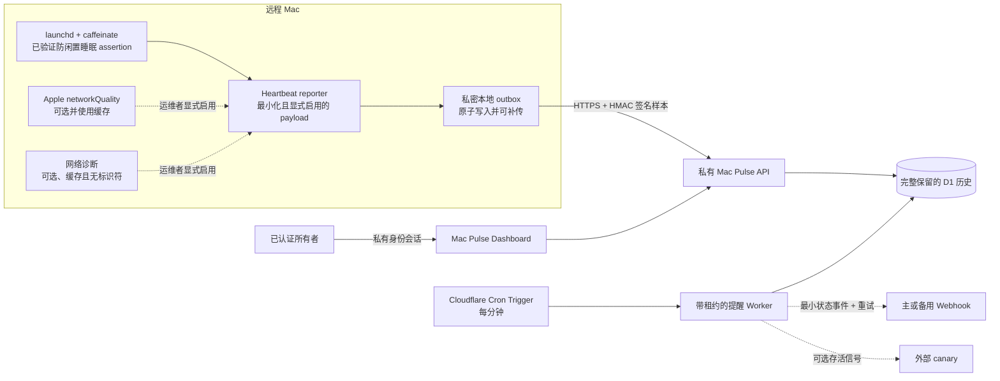

# 架构说明

[English](ARCHITECTURE.md) | [简体中文](ARCHITECTURE.zh-CN.md)

Remote Mac KeepAwake 默认完全在本机运行。只有运维者显式安装 heartbeat reporter
后，才会启用可选的 Mac Pulse 路径。

## 信任边界

- KeepAwake 在本机运行，不依赖 Mac Pulse。
- 查看者身份与 heartbeat 上传使用相互独立的授权路径。每次上传都包含
  HMAC-SHA-256 签名、key ID、五分钟防重放窗口和随机幂等 ID；轮换期间可有限接受
  current、next、previous 三个槽位，无需重启 reporter。
- Heartbeat 不包含电脑名称、用户名、IP 地址、序列号、位置、webhook 目标或密钥。
- 可选网络诊断只保存布尔结果、网关性能、规范化故障类别和时间，不保存网关、
  DNS、SSID、公网 IP 或 endpoint 标识符。
- 每个 heartbeat 都会在上传前先保存到本地；发送失败时留在受保护 outbox 中，
  恢复后使用幂等 ID 自动补传。
- Cron 在计算状态前取得 D1 租约。发送次数与有限退避重试可跨 Worker 重启保留；
  备用 Webhook 和外部 canary 均为可选，其 URL 只存在于服务端 secret。
- 没有收到 heartbeat 只能证明外部监控端没有收到近期样本，不能证明具体根因。
- FileVault 启动前解锁、电源、网络、合盖、硬件和操作系统故障均不属于软件能够
  控制的范围。
